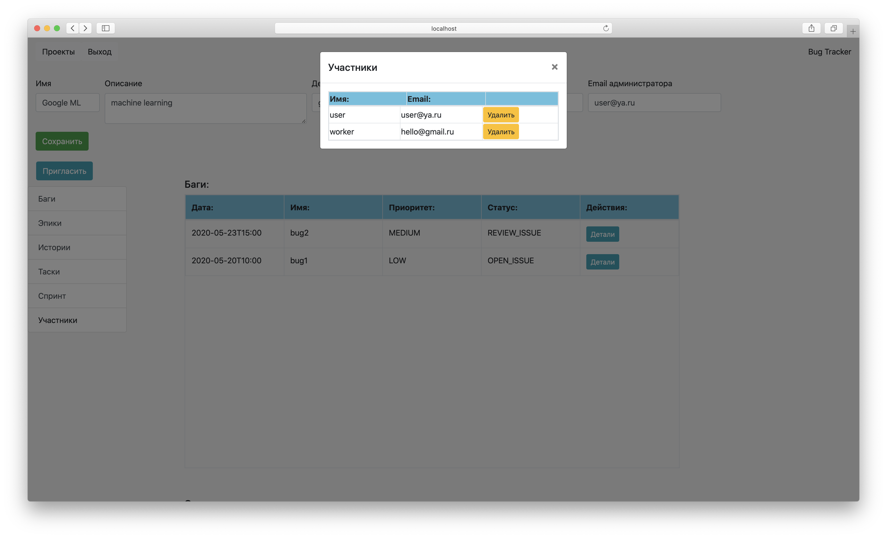
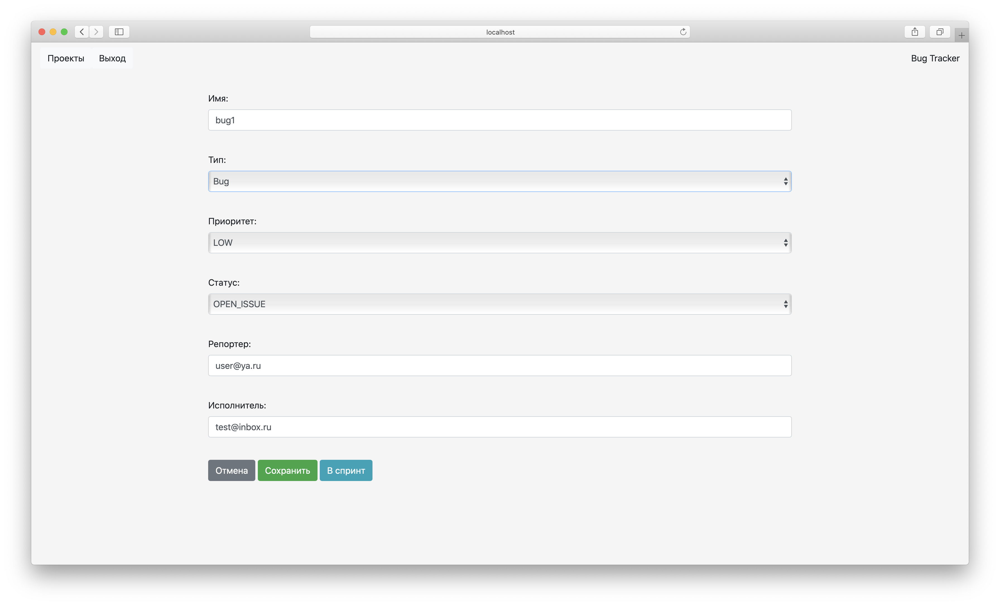
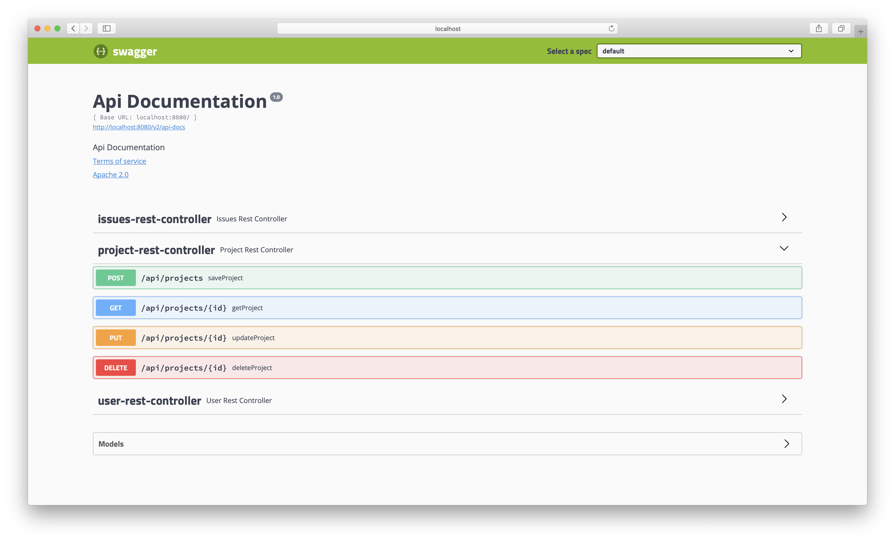

# Web-проект Bug Tracker
### Для работы с проектом понадобится:

* java 8/11
* Maven

### Стэк используемых технологий:

* Spring-Boot Web
* Spring-Boot Security
* JDBC
* Hibernate 5.4.0 + Spring ORM + javax.validation
* PostgreSQL
* JUnit + Spring Tests
* Apache Tomcat
* JSP + JSTL
* Bootstrap + Webjars
* SwaggerUI

### Описание реализации:

Приложеине реализует логику трекера задач, позволяя пользователям собираться 
в команды и работать над проектами. В проектах есть администраторы, менеджеры, а также разделение
задач на баги, эпики, истории и таски. Задачи разделены между бэклогом и спринтом проекта, 
у которого отдельное пространство. Участники проекта могут редактировать, менять статус задач, 
а также перемещать их в пространстве проекта.

Безопасность реализована как для работы в интерфейсе, так и для API методов. При входе пользователь 
аутентифицируется spring'ом на основе тех данных, которые хранятся в БД в зашифрованном ByCript-виде и 
сверяет их. При успешной сверке на период сессии пользователь получает доступ к определенным ресурсам.
В API-методах реализована аутентификация и сверка ролей пользователя. Имплементирован интерфейс 
spring'a - `UserDetailsService`, а также реализован класс `org.springframework.security.core.userdetails.User`  

### Особенности сборки и запуска:
 
Перед запуском необходимо указать параметры подключения к БД. Инофрмацию нужно внести в `resources/application.yaml`,
например: 

```
spring:
  datasource:
    url: jdbc:postgresql://localhost:5432/tracker
    username: user
    password: password
    driver-class-name: org.postgresql.Driver
``` 

А также(опционально) в `resources/jdbc/db.properties`, т.к. в приложении несколько профилей исполнения
о чем будет информация ниже:

```
db.className=org.postgresql.Driver
db.url=jdbc:postgresql://localhost:5432/tracker
db.user=user
db.password=password
``` 

В приложении выполнено несколько spring-профилей:
* '**dev**' - профиль первого запуска, который позволит автоматически инициализировать и наполнить
 данными БД. Также будет выводиться дополнительное логирование. Приложение будет доступно по порту 8080
 и работать по http.
 
* '**prod**' - приложение доступно по порту 8443 и активирован https, отключено дополнительное логирование.
Изменений и манипуляций с БД при старте не происходит. Схема уже должна быть инициализирована. Выпущен
сертификат для localhost - `resources/BugTracker.cer`, который можно установить как доверенный на 
свою персональныю машину и не получать предупреждений в браузере.

* '**jdbc**' - работа со слоем хранения через чистый JDBC.

* '**jpa**' - работа со слоем хранения через Hibernate ORM.

### Варианты запуска приложения с разными реализациями:

```
mvn spring-boot:run -Dspring-boot.run.arguments="--spring.profiles.active=dev,jpa"
```

```
mvn spring-boot:run -Dspring-boot.run.arguments="--spring.profiles.active=dev,jdbc"
```

```
mvn spring-boot:run -Dspring-boot.run.arguments="--spring.profiles.active=prod,jpa"
```

```
mvn spring-boot:run -Dspring-boot.run.arguments="--spring.profiles.active=prod,jdbc"
```

# Обзор работы приложения

При инициализации БД создаются пользователи, с помощью которых можно выполнить вход:

Логин:
user@ya.ru

Пароль: password

(еще пользователи: test@inbox.ru-testpass, hello@gmail.ru-workerpass)

 

После входа будет отображен рабочий стол с проектами пользователя. Здесь можно зайти в конкртеный
проект, а если пользователь является администратором, то активна кнопка удаления проекта.


При создании проекта необходимо заполнить данные, а также ввести существующие email менеджера и
администратора. 


На старнице проекта отражено его описание и выведны все типы задач из бэклога и спринта по разделам.
Участники проекта могут смотреть/редактировать/удалять задачи, а также пермещать их и создавать 
новые(кнопка 'Задача').   


Если пользователь является менеджером или администратором, то у него будет
активна кнопка 'Пригласить', по которой можно добавить в проект нового участника.


Список участников доступен для просмотра всем, но удалять может только менеджер или администратор.



Меню создания/редактирования задач - можно изменять тип, статус, иполнителя, а также перемещать из бэклога в 
спринт.



Обзор доступных api доступен через интерфейс SwaggerUI. Примеры запросов также находятся в тестовом каталоге api.

